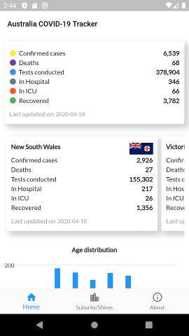
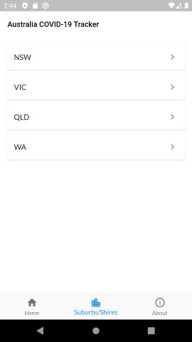
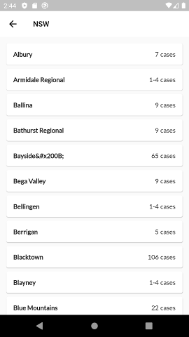
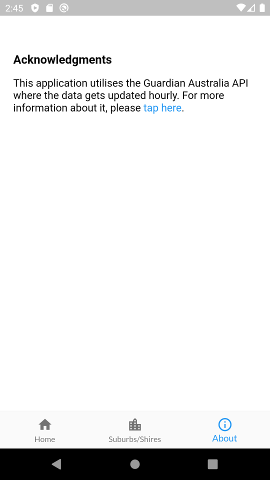

# Australia COVID-19 Tracker   
This is a [Flutter](https://flutter.dev) application that shows COVID-19 data that's provided by the Guardian Australia API.
  
There are 3 screens that I built so far.

1. Home: This shows National, States and Age Distribution (NSW and VIC).

    

2. Suburbs/Shires: Shows suburbs/cities/shires data in NSW, VIC, QLD and WA.

    
    
    

3. About: A simple page about the application.

    
  
## Folder structure

### lib

- models: The Guardian Model gets constructed when the call to the Guardian API is successful.  
- providers: At this stage, we only have 1 provider which is the Guardian Provider.   
This provider is responsible for making the HTTP call to the Guardian API endpoint.  
- utils: Utility classes.  
- views: Parent views that contain widgets.  
- widgets: List of small widgets.  
  
### assets

- [List of symbols of states wikipedia](https://en.wikipedia.org/wiki/List_of_symbols_of_states_and_territories_of_Australia): For state icons in the widget  
  
### test

Contains some simple tests.  
  
## References

- The design inspired by [Conceptual Dashboard Screen by Ohad Peled](https://dribbble.com/shots/9084817-Conceptual-Dashboard-Screen).
- Development:  
  - [My wallet app ui](https://github.com/singh-saheb/my_wallet_app_ui).
  - [future_widget_test.dart by brianegan](https://gist.github.com/brianegan/414f6b369c534a0e5f20bff377823414).
  - [Flutter cookbook](https://flutter.dev/docs/cookbook).
  - [The Guardian API](https://www.arcgis.com/home/item.html?id=35b077523be94f7288b21db815e6e6e6).

## Notes

This application meant for personal use only and **not meant** to be distributed on the Google Play / Apple App Store because they prohibit applications that are related to COVID-19 that don't come from authorised institutions.
